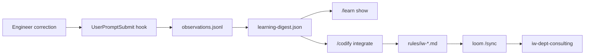

# IW Demo — Architecture / Ops Scenarios (PC1 Script)

Step-by-step script for **PC1 (architect)** on institutional memory, compliance ops, and graduated autonomy. Slides + loom commands; no browser required for L1–T1.

**Client:** Meridian Public Services (MPS)  
**Master plan:** `.cursor/plans/mps_mock_enterprise_demo_0c4cfc38.plan.md`  
**Consultancy tier:** **Operate** (drift checks, posture reviews, codify cycles)  
**Linkage:** `.claude/bin/loom-links.local.json` — `reposRoot: C:/Users/QL/IW/repos/iw`

**Related demo docs:**

| Repo | Doc |
|------|-----|
| `iw-coc-template` | `docs/demo/PROMPT_CARDS.md`, `REHEARSAL_CHECKLIST.md`, `SYNC_LOG.md` |
| `IW-legacy-portal` | `docs/demo/RUNTIME_SCENARIOS.md` |
| `loom` (this file) | `docs/demo/samples/` — slide-embed artifacts |

---

## Pitch segment map (~17–19 min on PC1)

| Min | ID | Beat | Capability |
|-----|-----|------|------------|
| 17–18 | **L1** | `/codify` → Gate-1 → `/sync` → consulting inherits rule | Institutional memory |
| 17–18 | **L2** | `/learn` — correction became codify input | Continuous improvement |
| 18–19 | **I1** | `/inspect secrets` + drift sample (slide or live) | Ongoing compliance ops |
| 18–19 | **T1** | `/posture show` at L3 + path to L5 | Graduated autonomy |

> **CISO bridge (before L1):** *"Chat corrections are lost forever in Copilot. Our `/learn` → `/codify` loop turns pushback into versioned rules every repo inherits."*

---

## Before you start

| Check | Command / path |
|-------|----------------|
| Loom checkout | `C:\Users\QL\IW\repos\IW\loom` |
| Linkage declared | `loom`, `use-template.py` → `IW-coc-template`, `downstream.consulting` → `IW-dept-consulting` |
| Template distributed | `iw-coc-template/SYNC_LOG.md` — Stage 4 receipt |
| Posture init | `iw-dept-consulting/.claude/learning/posture.json` → `L3_SHARED_PLANNING` |
| Sample artifacts | `docs/demo/samples/` in this repo |

### PC1 IDE sessions (optional live)

| Session | Repo | Purpose |
|---------|------|---------|
| A | `loom` | Gate-1 `/sync`, `/inspect`, optional global proposal |
| B | `IW-coc-template` | USE-template `/codify` origination |
| C | `IW-dept-consulting` | Downstream `/sync`, `/posture show`, `/certify` context |

Live Gate-2 distribution is **optional** — slide + sample YAML suffices if Wi‑Fi or time is tight.

---

## L1 — Codify → Gate-1 classify → sync → dept inherits rule

**Capability:** Institutional memory — corrections become artifacts; loom distributes to USE consumers.  
**Pitch segment:** ~17–18 min (after runtime brownfield beats).

### Narrator line (open L1)

> *"When an engineer corrects the agent once, we don't hope the model remembers. `/learn` captures it, `/codify` proposes a rule change, loom classifies at Gate-1, and every department repo inherits on the next sync."*

### Story arc (talk track)

1. **Origin** — Platform engineer in `IW-legacy-permits` redirects clerk-role Restricted field exposure (E3 rehearsal).
2. **Capture** — Hooks write `user_correction` to observations; `/learn` lists it in the digest.
3. **Codify** — `/codify` on `IW-coc-template` strengthens `rules/iw-data-classification.md` and writes `.claude/.proposals/latest.yaml`.
4. **Gate-1** — At `loom`, `/sync` runs sync-reviewer: disclosure scrub → classify `coc` tier → human marks `reviewed`.
5. **Gate-2** — loom distributes to `IW-coc-template` canonical; consumer `IW-dept-consulting` runs `/sync` and inherits the rule.
6. **Proof** — Consultant agent on C2 scenarios cites the same `iw-data-classification.md` as engineering.

### Live rehearsal steps

#### Step 1 — Show the proposal (USE-template stream)

```powershell
cd C:\Users\QL\IW\repos\IW\IW-coc-template
# Rehearsal: copy sample proposal (do not distribute without approval)
# Copy-Item ..\loom\docs\demo\samples\l1-use-template-proposal.yaml .claude\.proposals\latest.yaml
```

**Sample proposal:** `docs/demo/samples/l1-use-template-proposal.yaml`

Key fields PC1 calls out on slide:

| Field | Demo value | Meaning |
|-------|------------|---------|
| `origin` | `use-template` | COC-artifact lane (not BUILD/SDK) |
| `suggested_tier` | `coc` | Language-agnostic rule — IW consulting + legacy |
| `status` | `pending_review` | Gate-1 human classify required |

#### Step 2 — Gate-1 at loom

```powershell
cd C:\Users\QL\IW\repos\IW\loom
# /sync   (or /sync base if manifest subscribed — IW demo uses use-template.py linkage)
```

**Narrator line (Gate-1):**

> *"Loom doesn't trust the model to self-merge policy. Gate-1 is human classify: global versus variant, disclosure scrub, tier assignment. Only then does distribution run."*

**Pass indicators:**

- [ ] sync-reviewer reports `origin: use-template` proposal
- [ ] `iw-data-classification.md` classified `coc` tier
- [ ] Proposal status moves `pending_review` → `reviewed` (operator action)
- [ ] No disclosure findings from `scan-synced-disclosure.mjs`

#### Step 3 — Downstream inherit (Gate-2 + consumer pull)

```powershell
cd C:\Users\QL\IW\repos\IW\IW-dept-consulting
# /sync   — pulls from IW-coc-template per VERSION upstream pin
```

**Narrator line (inherit):**

> *"Consultants don't get a different rulebook. They get the same git artifacts engineering just codified — after `/certify` proves they read them."*

**Pass indicators:**

- [ ] `rules/iw-data-classification.md` hash matches template post-sync
- [ ] `.claude/VERSION` `upstream.synced_at` updated
- [ ] `SYNC_LOG.md` receipt updated (operator-local in `iw-coc-template`)

### L1 optional — global rule tweak (loom proposal form)

Rehearses **cc-tier** global classify without IW-specific rule content.

1. **Sample proposal:** `docs/demo/samples/l1-loom-global-proposal.yaml`
2. **Staged rule tweak:** `.claude/rules/git.md` § Demo Documentation Scope (committed in loom — pending Gate-2 approval for distribution)
3. Copy proposal to `loom/.claude/.proposals/latest.yaml` for Gate-1 walkthrough only.

**Narrator line:**

> *"Not every improvement is client-specific. Global git discipline flows through the same proposal form — Gate-1 still applies."*

**BLOCKED without approval:** Gate-2 `/sync` that ships `git.md` tweak to USE templates.

---

## L2 — Learn loop (correction → codify input)

**Capability:** Continuous improvement — hooks aggregate; `/codify` does semantic integration.  
**Pitch segment:** ~17–18 min (paired with L1; can be slide-only).

### Narrator line

> *"This journal entry is the receipt. The engineer pushed back on a debug dump; `/learn` surfaced it; `/codify` turned it into a MUST rule with examples. That's institutional memory — not chat history."*

### Show `/learn` output shape

```powershell
cd C:\Users\QL\IW\repos\IW\IW-legacy-permits
# /learn
```

Present from digest (structure — live file is gitignored per operator):

| Section | L2 demo content |
|---------|-----------------|
| **Corrections** | *"Clerks never get Restricted fields in API responses…"* |
| **Decisions** | `journal/…` reference → sample below |
| **Error patterns** | (optional) prior `iw-data-classification` violations |

### Sample journal entry (slide embed)

**File:** `docs/demo/samples/l2-learn-journal-entry.md`

PC1 highlights:

- `type: DISCOVERY` — semantic context for `/codify`
- Engineer verbatim correction in body
- Follow-up checklist showing proposal + Gate-1 done, downstream sync gated

### Loop diagram (slide)



---

## I1 — Inspect secrets / drift (Operate tier)

**Capability:** Ongoing compliance ops — cross-repo secrets scan + COC drift without a GRC ticket queue.  
**Pitch segment:** ~18–19 min.

### Narrator line (open I1)

> *"Assess tier finds gaps; Operate tier runs `/inspect` on a schedule. Same linkage map as sync — drift and secrets across every repo the customer owns in git."*

### Slide embed (recommended)

**File:** `docs/demo/samples/inspect-secrets-iw-org.txt`

PC1 walkthrough:

| Row | Talk track |
|-----|------------|
| 6 repos scanned | Linkage via `loom-links.local.json`, not positional paths |
| 1 WARN on legacy | Demo `OPENAI_API_KEY` default in compose — expected, documented |
| Drift partial on agent-layer | Intentional Stage 4 scope (rules/skills only) per `SYNC_LOG.md` |
| Exit 1 WARN, 0 BLOCK | Retainer-friendly — findings, not theatre |

### Live alternative (if fast)

```powershell
cd C:\Users\QL\IW\repos\IW\loom
# /inspect secrets all
# /inspect drift all
```

Fall back to sample file if network or scan exceeds 60s on stage.

### Narrator line (close I1)

> *"GRC tells you someone should check. `/inspect` shows what drifted and what leaked — tied to the same artifact versions your agents already run."*

---

## T1 — Posture show (L3 today, path to L5)

**Capability:** Graduated autonomy — agents don't get delegated trust on day one.  
**Pitch segment:** ~18–19 min.

### Narrator line (open T1)

> *"We don't hand contractors — or models — L5 delegated autonomy on day one. MPS consulting repos start at L3 supervised planning; upgrades are earned with challenge-nonce and 4-eyes approval."*

### Live command

```powershell
cd C:\Users\QL\IW\repos\IW\IW-dept-consulting
# /posture show
```

### Expected output (from init posture.json)

```text
Trust posture — IW-dept-consulting
──────────────────────────────────
Operative posture:  L3_SHARED_PLANNING
Repo floor:         L3_SHARED_PLANNING
At current level:   since 2026-06-15 (demo init)

Pending verification: (none)

Last transition:
  INIT → L3_SHARED_PLANNING
  reason: IW demo init — supervised planning; agents do not receive
          L5 delegated autonomy on day one (T1)

L3 agent CAN:     edit + run tests; one shard at a time
L3 agent CANNOT:  /todos plan without approval; feat/* commits; PR creation

Path to L5:
  L3 → L4 (+ journal/redteam gates) → L5 (human /posture upgrade + nonce)
```

### Posture ladder (slide — one graphic)

| Level | Name | Demo use |
|-------|------|----------|
| L1 | PSEUDO_AGENT | Fresh/corrupt fail-closed |
| L2 | SUPERVISED | Pre-`/certify` consultant |
| **L3** | **SHARED_PLANNING** | **IW demo init (today)** |
| L4 | CONTINUOUS_INSIGHT | + mandatory journal + redteam |
| L5 | DELEGATED | Earned — platform engineers after pilot |

### Narrator line (close T1 + segue to roadmap)

> *"SHADOW mode pilots runtime policy without blocking clerks. Posture L3 pilots IDE agents without letting them commit unsupervised. Same philosophy: measure, then enforce."*

---

## GRC comparison (PC1 slide — 30s)

| Their stack | Our Operate beat |
|-------------|------------------|
| Annual policy review | `/inspect` drift + secrets on every retainer cadence |
| Copilot guardrails (vendor) | `posture.json` + hooks the customer owns in git |
| Corrections lost in chat | L2 learn loop → L1 codify/sync |
| Big-bang AI enablement | L3 today → L5 earned (T1) |

---

## Rehearsal checklist (PC1)

### L1

- [ ] `l1-use-template-proposal.yaml` on slide or copied for live Gate-1
- [ ] `loom-links.local.json` resolves `use-template.py` + `downstream.consulting`
- [ ] Operator knows whether Gate-2 live sync is approved for pitch day
- [ ] Optional: `l1-loom-global-proposal.yaml` for cc-tier classify demo

### L2

- [ ] `l2-learn-journal-entry.md` embedded in deck
- [ ] `/learn` flow described (corrections section) even if live digest empty

### I1

- [ ] `inspect-secrets-iw-org.txt` screenshot in deck
- [ ] SYNC_LOG partial-drift note ready if audience asks about agent-layer

### T1

- [ ] `/posture show` dry-run in `IW-dept-consulting`
- [ ] L3→L5 ladder slide matches `rules/trust-posture.md`
- [ ] Bridge line to S1 SHADOW (PC3) rehearsed

---

## Artifact index

| File | Demo ID | Use |
|------|---------|-----|
| `samples/l1-use-template-proposal.yaml` | L1 | Gate-1 USE-template proposal |
| `samples/l1-loom-global-proposal.yaml` | L1 optional | Global cc-tier proposal |
| `samples/l2-learn-journal-entry.md` | L2 | Journal → codify receipt |
| `samples/inspect-secrets-iw-org.txt` | I1 | Slide embed /inspect output |
| `ARCHITECTURE_OPS.md` | L1–T1 | This script |

---

## Cross-links

- Distribution receipt: [`iw-coc-template/SYNC_LOG.md`](../../IW-coc-template/SYNC_LOG.md)
- Engineering prompts: [`iw-coc-template/docs/demo/PROMPT_CARDS.md`](../../IW-coc-template/docs/demo/PROMPT_CARDS.md)
- Runtime clerk script: [`IW-legacy-portal/docs/demo/RUNTIME_SCENARIOS.md`](../../IW-legacy-portal/docs/demo/RUNTIME_SCENARIOS.md)
- Master plan: `.cursor/plans/mps_mock_enterprise_demo_0c4cfc38.plan.md`
